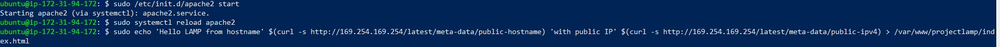

## Project 1 - Process Documentation

**WEB STACK IMPLEMENTATION (LAMP STACK) IN AWS**

**STEP 1 — INSTALLING APACHE AND UPDATING THE FIREWALL**        
This was executed using the using Ubuntu’s package manager ‘apt’

`sudo apt update`   
`sudo apt install apache2`  
`sudo systemctl status apache2`                                 
*See below the output of the above listed scripts:*

Before we can receive any traffic by our Web Server, we need to open TCP port 80 which is the default port that web browsers use to access web pages on the Internet. This was successfuly configured on the inbound rules of my AWS EC2 ubuntu machine.
I used the commands below to see how I can access it locally;

` curl http://localhost:80
or
 curl http://127.0.0.1:80`

 Now to test how my Apache HTTP server can respond to requests from the Internet, see response below:
 

**STEP 2 — INSTALLING MYSQL**   
In this step, I basically installed a Database Management System (DBMS) to be able to store and manage data for my site in a relational database. 

Again, I used ‘apt’ to acquire and install mysql software:  
`$ sudo apt install mysql-server`   
Installed successfully and I logged in using the command below:

`$ sudo mysql`  

    

I had to further secure mysql by running the interactive script below to effect password changes for root user, etc.    
`$ sudo mysql_secure_installation`

**STEP 3 — INSTALLING PHP**
 
 PHP was installed to process code to display dynamic content to the end user.
 In addition to the php package, I insatlled *php-mysql*, a PHP module that allows PHP to communicate with MySQL-based databases and *libapache2-mod-php* to enable Apache to handle PHP files.     
To install these 3 packages at once, run:
`sudo apt install php libapache2-mod-php php-mysql`     

confirm installation with the below script;  

`php -v`    

At this point, my LAMP stack is completely installed and fully operational.
1. Linux (Ubuntu)
2. Apache HTTP Server
3. MySQL
3. PHP

**STEP 4 — CREATING A VIRTUAL HOST FOR YOUR WEBSITE USING APACHE**

Virtual host allows you to have multiple websites located on a single machine and users of the websites will not even notice it

I created a domain called *projectlamp*     
`sudo mkdir /var/www/projectlamp`       
Then assigned ownership with the following script;      
` sudo chown -R $USER:$USER /var/www/projectlamp`       
Then created and opened a new configuration file in Apache’s sites-available directory using the vi editor  
This creates a blank file. Pressing "i" on keyboard to enter insert mode. Then paste the following configuration into the file.     
`sudo vi /etc/apache2/sites-available/projectlamp.conf`     

 

Save the file afterwards and confirm that it is listed under the host folder.

I used the ls command to show the new file in the sites-available directory - 
`sudo ls /etc/apache2/sites-available/`

Seeing the below output is an indication that the directory was successfully created - *000-default.conf  default-ssl.conf  projectlamp.conf*

Then enabled the new host with the script below:    
`sudo a2ensite projectlamp`     
To make sure my config file doesn’t contain syntax errors, run:     
`sudo apache2ctl configtest`    
With no errors, I restarted Apache with the following command:  
`sudo systemctl restart apache2`

Now that the new website is active, but the web root /var/www/projectlamp is still empty. I had to create an index.html file in that location so that we can test that the virtual host works as expected:  
`sudo echo 'Hello LAMP from hostname' $(curl -s http://169.254.169.254/latest/meta-data/public-hostname) 'with public IP' $(curl -s http://169.254.169.254/latest/meta-data/public-ipv4) > /var/www/projectlamp/index.html`

